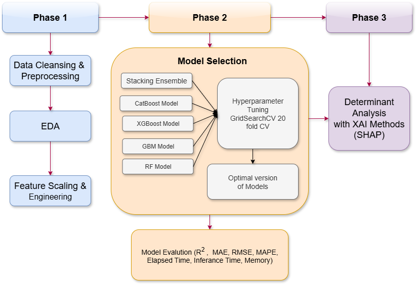

# 🏥 Clinical Data Influence on Health Insurance premium Predicting using ML and XAI

This project predicts medical insurance premiums using **machine learning models** and improves transparency with **explainable AI (XAI)** techniques such as SHAP.  
The study evaluates multiple ML algorithms and introduces stacking ensembles for improved accuracy and interpretability.

---

## 📊 Dataset
- **Source**: [Kaggle - Medical Insurance Premium Prediction](https://www.kaggle.com/datasets/tejashvi14/medical-insurance-premium-prediction)  
- **Records**: 986 samples  
- **Features**: Clinical & demographic attributes including:
  - Age  
  - Diabetes status  
  - Blood pressure problems  
  - Organ transplant history  
  - Chronic disease history  
  - Height & Weight (used to derive BMI)  
  - Allergies  
  - Family cancer history  
  - Number of major surgeries  

Target variable: **Premium Price**

---

## ⚙️ Models Used
- Random Forest (RF)  
- Gradient Boosting Machine (GBM)  
- XGBoost  
- CatBoost  
- GRC-Stack
- XC-Stack  

---

## 🔍 Key Features
- **Feature Engineering**: Derived **BMI** from height and weight.  
- **Hyperparameter Tuning**: Grid search with cross-validation.  
- **Visualization**: Learning curves, error plots, SHAP feature importance.  
- **Explainability (XAI)**: Used SHAP to interpret feature contributions.  

---

## Project Architecture




## 🚀 How to Run
### 1. Clone Repository
```bash
git clone https://github.com/Bhukya-Sriram/insurance-price-prediction-clinical-data.git
cd insurance-price-prediction-clinical-data
```

### 2. Install Requirements
```bash
pip install -r requirements.txt
```

### 3. Run the Jupyter Notebook
```bash
jupyter notebook predicting-medical-insurance-cost-with-clinical-data-using-ml-and-xai.ipynb
```

## 📂 Files in Repository

predicting-medical-insurance-cost-with-clinical-data-using-ml-and-xai.ipynb → Main project notebook

requirements.txt → List of dependencies

README.md → Project documentation

## 📈 Results

CatBoost and Stacking Ensemble outperformed traditional models.

Stacking achieved the best accuracy and generalization.

SHAP analysis revealed Age, BMI, and chronic disease history as key drivers of insurance premiums.

## 🧑‍💻 Authors

Bhukya Sriram (Information Technology, ABV-IIITM Gwalior)

Dr. Narinder Singh Punn (Information Technology, ABV-IIITM Gwalior)

## 📜 License

This project is released under the MIT License.
